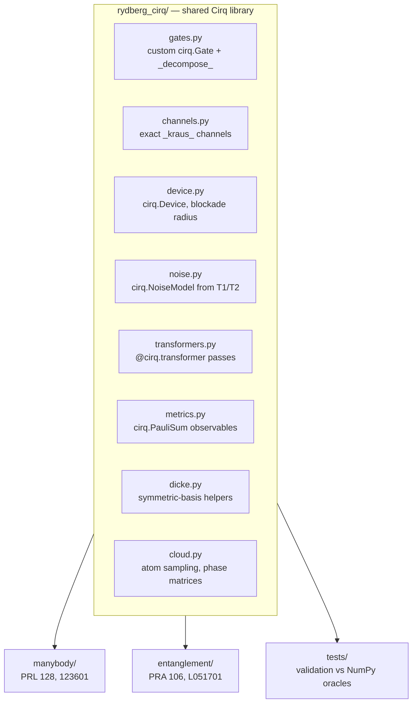

# Trapped Rydberg Atomic Ensembles in Google Cirq

Gate-level [Google Cirq](https://quantumai.google/cirq) reproductions of two
experiments from the Kuzmich group, built on a shared quantum-simulation library —
plus the author's original research code for several other publications from the
same group, lightly cleaned up rather than reimplemented (see below).

| Paper | Physics | Directory |
| :--- | :--- | :--- |
| [*Phys. Rev. Lett.* **128**, 123601 (2022)](https://doi.org/10.1103/PhysRevLett.128.123601)<br>*Trapped Alkali-Metal Rydberg Qubit* | Collective $\sqrt{N}$ Rabi oscillations of a Rydberg superatom, magic-wavelength lattice trapping, dynamical decoupling | [`manybody/`](./manybody) |
| [*Phys. Rev. A* **106**, L051701 (2022)](https://doi.org/10.1103/PhysRevA.106.L051701)<br>*Dynamics of Collective-Dephasing-Induced Multiatom Entanglement* | Interaction-induced dephasing converts an unentangled spin wave into an entangled Dicke state; $g^{(2)}(T_s)\to 0$ | [`entanglement/`](./entanglement) |

Everything physical is computed by a Cirq object — a circuit, custom gate, Kraus
channel, noise model, device, transformer, or simulator. NumPy is retained only as
an independent *oracle* to validate the Cirq layer.

---

## Other publications (original code, lightly cleaned up)

The two directories above are full from-scratch Cirq reimplementations. The three
below are the author's original NumPy/SciPy/C++ research code — dead cells, duplicate
notebooks, and lab-machine-specific paths removed, turned into standalone scripts —
but **not** rewritten into Cirq.

| Paper | Physics | Directory |
| :--- | :--- | :--- |
| [*Phys. Rev. A* **108**, 043713 (2023)](https://doi.org/10.1103/PhysRevA.108.043713)<br>*Interference Bunching and Antibunching of Coherent Atomic Radiation Fields* | $g^{(2)}(\phi)$ for factorized/truncated collective atomic states interfering with a reference field; interaction-induced dephasing for uniform and Gaussian clouds | [`interference_bunching/`](./interference_bunching) |
| [*Phys. Rev. Lett.* **133**, 213601 (2024)](https://doi.org/10.1103/PhysRevLett.133.213601)<br>*Dipole Moment of a Superatom* | Homodyne measurement of the collective atomic dipole moment: interference fringe visibility and $g^{(2)}_\text{max}$ vs. excitation probability and probe amplitude | [`superatom_dipole_moment/`](./superatom_dipole_moment) |
| [*Phys. Rev. A* **97**, 043401 (2018)](https://doi.org/10.1103/PhysRevA.97.043401)<br>*Expansion of an Ultracold Rydberg Plasma*, and the author's 2019 Colby College honors thesis of the same title | Monte Carlo kinetic simulation — three-body recombination, electron-Rydberg scattering, radiative $n,l$-cascade decay, coupled to an RK2 hydrodynamic expansion | [`plasma_expansion/`](./plasma_expansion) |

`interference_bunching/` and `superatom_dipole_moment/` need the optional `legacy`
extra (`pandas`, `numba`, `ARC-Alkali-Rydberg-Calculator` — see Setup below).
`plasma_expansion/` is C++; build it with `make` inside that directory.

## Unpublished / exploratory work

[`misc/`](./misc) holds cleaned-up but unpublished code from grad school: a
Jaynes-Cummings collective-dynamics model, Rydberg dipole matrix elements for a
biphoton-generation scheme, and Rydberg-array phase-matched scattering efficiency.
See [`misc/README.md`](./misc/README.md) for details; polish bar is lower there since
there's no published figure to validate against.

---

## Setup from a fresh clone

The virtualenv is **not** tracked by git, so recreate it once after cloning
(Python 3.10+ required):

```bash
git clone https://github.com/yinlium/quantum.git
cd quantum

python3 -m venv .venv
.venv/bin/python -m pip install --upgrade pip
.venv/bin/python -m pip install -e ".[mps,dev,legacy]"
```

The `mps` extra pulls in `quimb` + `opt_einsum` (needed by
`manybody/cirq_mps_large_n.py`); `dev` pulls in `pytest`; `legacy` pulls in
`pandas` + `numba` + `ARC-Alkali-Rydberg-Calculator` (needed by
`interference_bunching/` and `superatom_dipole_moment/`). For the core Cirq
simulations alone, `pip install -e .` is enough.

Verify the install:

```bash
.venv/bin/python -m pytest tests/ -q      # expect: 73 passed
```

> [!NOTE]
> The upstream `Cirq/` source checkout referenced in the layout below is also
> gitignored — it was a local reference copy only. Cirq is installed from PyPI
> by the command above, so nothing depends on it.

---

## Quick start

```bash
.venv/bin/python -m pytest tests/ -q      # 73 validation tests
.venv/bin/python run_all.py --list        # catalogue of every simulation
.venv/bin/python run_all.py               # regenerate every figure
.venv/bin/python run_all.py --only rabi   # run a subset
```

The shared library is installed editable, so `import rydberg_cirq as rc` works from
any directory.

---

## Architecture



### `rydberg_cirq/` module map

| Module | Contents |
| :--- | :--- |
| [`gates.py`](./rydberg_cirq/gates.py) | `CollectiveLaserDriveStep`, `RydbergBlockadeStep`, `PairwisePhaseGate`, `MagicLatticeStorageGate` — all with native `_decompose_` |
| [`channels.py`](./rydberg_cirq/channels.py) | `CollectiveDephasingChannel` (exact finite Kraus set), `RydbergDecayChannel` |
| [`device.py`](./rydberg_cirq/device.py) | `RydbergTweezerDevice` — rejects entangling gates outside the blockade radius |
| [`noise.py`](./rydberg_cirq/noise.py) | `RydbergNoiseModel` — amplitude/phase damping derived from physical $T_1$, $T_2^*$ |
| [`transformers.py`](./rydberg_cirq/transformers.py) | `compile_dynamical_decoupling`, `compile_to_rydberg_hardware`, `circuit_stats` |
| [`metrics.py`](./rydberg_cirq/metrics.py) | Collective spin as `cirq.PauliSum`; concurrence, QFI, squeezing, $g^{(2)}$ |
| [`dicke.py`](./rydberg_cirq/dicke.py) | Dicke states, projectors, Poissonian spin-wave amplitudes |
| [`cloud.py`](./rydberg_cirq/cloud.py) | Gaussian cloud sampling and pairwise interaction phases |

---

## Conventions

Getting these wrong silently corrupts every downstream result, so they are stated
once here and enforced by the test suite.

$$|0\rangle \equiv |g\rangle, \qquad |1\rangle \equiv |r\rangle$$

so the excitation number $m$ is the Hamming weight of a basis label, and

$$J_x = +\tfrac{1}{2}\sum_j X_j, \qquad J_y = -\tfrac{1}{2}\sum_j Y_j, \qquad J_z = -\tfrac{1}{2}\sum_j Z_j$$

The signs of $J_y$ and $J_z$ are fixed by requiring $J_z|g\cdots g\rangle = -\tfrac{N}{2}|g\cdots g\rangle$
together with the angular-momentum algebra $[J_x, J_y] = iJ_z$. Both are checked in
[`tests/test_rydberg_cirq.py`](./tests/test_rydberg_cirq.py).

> [!WARNING]
> The legacy [`entanglement/metrics.py`](./entanglement/metrics.py) reconstructs the
> two-atom density matrix without these signs, which swaps the $|gg\rangle$ and
> $|rr\rangle$ labels. Concurrence is invariant under that relabeling so its published
> numbers are unaffected, but use `rydberg_cirq.metrics` for anything that reads
> $\rho_{12}$ matrix elements directly.

---

## Why an exact Kraus channel for collective dephasing

Collective dephasing damps coherences between different total excitation numbers:

$$\rho_{mm'} \;\longrightarrow\; \rho_{mm'}\, e^{-\gamma_c \tau (m-m')^2/2}$$

The corresponding matrix $D_{ss'} = e^{-\gamma_c\tau(m_s-m_{s'})^2/2}$ is a Gaussian
kernel evaluated at integer points, hence **positive semi-definite**. Its
eigendecomposition $D=\sum_k \lambda_k v_k v_k^{\mathsf T}$ therefore yields an
*exact, finite* set of diagonal Kraus operators $K_k=\sqrt{\lambda_k}\,\mathrm{diag}(v_k)$,
with $\sum_k K_k^\dagger K_k = \mathrm{diag}(D_{ss}) = I$.

Consequences:

- No Trotter/Strang discretization error, unlike the hand-rolled master-equation solver it replaces.
- No trajectory sampling noise.
- Only $N{+}1$ Kraus operators are needed (the rank equals the number of distinct excitation numbers) — 5 operators for $N=4$.
- Every fixed-$m$ sector, including $|W\rangle$, is **exactly invariant** — which is precisely the mechanism by which dephasing purifies a multi-excitation spin wave into a single-excitation Dicke state.

---

## Cirq API coverage

| Cirq feature | Where it is used |
| :--- | :--- |
| Custom `cirq.Gate` + `_decompose_` | `rydberg_cirq/gates.py` |
| Custom `_kraus_` channels | `rydberg_cirq/channels.py` |
| `cirq.Device` + `cirq.Gateset` + `DeviceMetadata` | `rydberg_cirq/device.py` |
| `cirq.NoiseModel` + `VirtualTag` | `rydberg_cirq/noise.py` |
| `@cirq.transformer` compiler passes | `rydberg_cirq/transformers.py` |
| `cirq.PauliSum` expectation values | `rydberg_cirq/metrics.py` |
| `cirq.Simulator` (statevector) | superatom Rabi, ansatz verification |
| `cirq.DensityMatrixSimulator` | collective dephasing, noisy Rabi |
| `sympy.Symbol` + `cirq.Linspace` sweeps | $g^{(2)}(T_s)$, Ramsey metrology |
| `sim.run(repetitions=...)` sampling | shot-noise $g^{(2)}$ |
| `cirq.contrib.quimb` tensor networks | large-$N$ superatom |
| `cirq.optimize_for_target_gatesets`, `merge_single_qubit_moments_to_phxz` | compilation pipeline |

---

## Repository layout

```
quantum/
├── rydberg_cirq/              shared Cirq library
├── manybody/                  PRL 128, 123601 reproductions + figures
├── entanglement/               PRA 106, L051701 reproductions + figures
├── interference_bunching/      PRA 108, 043713 (original code, cleaned up)
├── superatom_dipole_moment/    PRL 133, 213601 (original code, cleaned up)
├── plasma_expansion/           PRA 97, 043401 + honors thesis (C++)
├── misc/                       unpublished/exploratory code
├── tests/                      validation against NumPy/analytic oracles
├── run_all.py                 regenerate every figure
├── pyproject.toml
├── LICENSE
└── README.md
```

Two paths exist locally but are **not tracked** (see [`.gitignore`](./.gitignore)):
`.venv/`, recreated by the setup command above, and `Cirq/`, a local checkout of
the upstream Cirq source kept purely for reading. Nothing in this repository
imports from it — Cirq comes from PyPI.

Detailed physics write-ups live in
[`entanglement/THEORY_AND_REPRODUCTION.md`](./entanglement/THEORY_AND_REPRODUCTION.md)
and [`manybody/README.md`](./manybody/README.md).

---

## License

Released under the [MIT License](./LICENSE).

`manybody/` and `entanglement/` are independent reproductions of experiments by
Y. Mei, Y. Li, H. Nguyen, P. R. Berman, and A. Kuzmich; please cite
[*Phys. Rev. Lett.* **128**, 123601 (2022)](https://doi.org/10.1103/PhysRevLett.128.123601)
and [*Phys. Rev. A* **106**, L051701 (2022)](https://doi.org/10.1103/PhysRevA.106.L051701)
rather than this code. [Cirq](https://github.com/quantumlib/Cirq) is licensed
separately under Apache-2.0.

`interference_bunching/`, `superatom_dipole_moment/`, and `plasma_expansion/` are the
author's own original research code; please cite the corresponding papers if you use
them: [*Phys. Rev. A* **108**, 043713 (2023)](https://doi.org/10.1103/PhysRevA.108.043713),
[*Phys. Rev. Lett.* **133**, 213601 (2024)](https://doi.org/10.1103/PhysRevLett.133.213601),
and [*Phys. Rev. A* **97**, 043401 (2018)](https://doi.org/10.1103/PhysRevA.97.043401).

